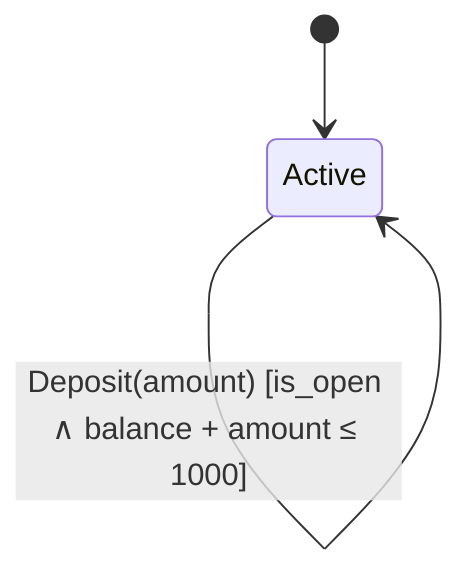

# BankAccount — Proof of Work

## State Definition

| Field | Type |
|-------|------|
| balance | int |
| is_open | bool |

**Initial state:** `BankAccount(balance=0, is_open=True)`

## Invariants

- **BalanceNonNegative**: `balance ≥ 0`
- **BalanceBounded**: `balance ≤ 1000`

## State Transitions

### Withdraw

| | |
|---|---|
| **Guard** | `is_open ∧ balance ≥ 50` |
| **Effect** | `balance' = balance - 50` |
| **Postcondition** | `balance' = balance - 50` |

### Close

| | |
|---|---|
| **Guard** | `balance = 0` |
| **Effect** | `is_open' = ⊥` |
| **Postcondition** | `¬is_open'` |

### Reopen

| | |
|---|---|
| **Guard** | `¬is_open` |
| **Effect** | `is_open' = ⊤` |
| **Postcondition** | `is_open'` |

### Deposit *(parametric: amount)*

| | |
|---|---|
| **Guard** | `is_open ∧ balance + amount ≤ 1000` |
| **Effect** | `balance' = balance + amount` |
| **Postcondition** | `balance' = balance + amount` |

## Temporal Properties

- **Eventually**(CanClose): `¬is_open`
- **LeadsTo**(BalanceCanDrain): `is_open ∧ balance > 0` ⟹ `balance = 0`
- **AlwaysEventually**(CanDeposit): `is_open`
