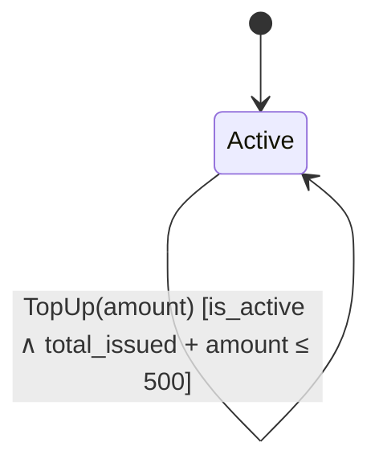

# GiftCard — Proof of Work

## State Definition

| Field | Type |
|-------|------|
| balance | int |
| is_active | bool |
| total_issued | int |
| total_redeemed | int |

**Initial state:** `VerifyState(balance=0, is_active=False, total_issued=0, total_redeemed=0)`

## Invariants

- **BalanceNonNegative**: `balance ≥ 0`
- **BalanceConsistent**: `balance = total_issued - total_redeemed`

## State Transitions

### Cancel

| | |
|---|---|
| **Guard** | `is_active` |
| **Effect** | `balance' = 0, is_active' = ⊥, total_issued' = total_redeemed, ` |
| **Postcondition** | `( balance' = 0 ∧ ¬is_active' )` |

### Issue *(parametric: amount)*

| | |
|---|---|
| **Guard** | `¬is_active` |
| **Effect** | `balance' = balance + amount, is_active' = ⊤, total_issued' = total_issued + amount, ` |
| **Postcondition** | `( balance' = balance + amount ∧ is_active' ∧ total_issued' = total_issued + amount )` |

### Redeem *(parametric: amount)*

| | |
|---|---|
| **Guard** | `is_active ∧ balance ≥ amount` |
| **Effect** | `balance' = balance - amount, total_redeemed' = total_redeemed + amount, ` |
| **Postcondition** | `( balance' = balance - amount ∧ total_redeemed' = total_redeemed + amount )` |

### TopUp *(parametric: amount)*

| | |
|---|---|
| **Guard** | `is_active ∧ total_issued + amount ≤ 500` |
| **Effect** | `balance' = balance + amount, total_issued' = total_issued + amount, ` |
| **Postcondition** | `( balance' = balance + amount ∧ total_issued' = total_issued + amount )` |

## Temporal Properties

- **LeadsTo**(IssuedCanReachZero): `is_active ∧ balance > 0` ⟹ `balance = 0`
- **Eventually**(CanBeIssued): `is_active`
