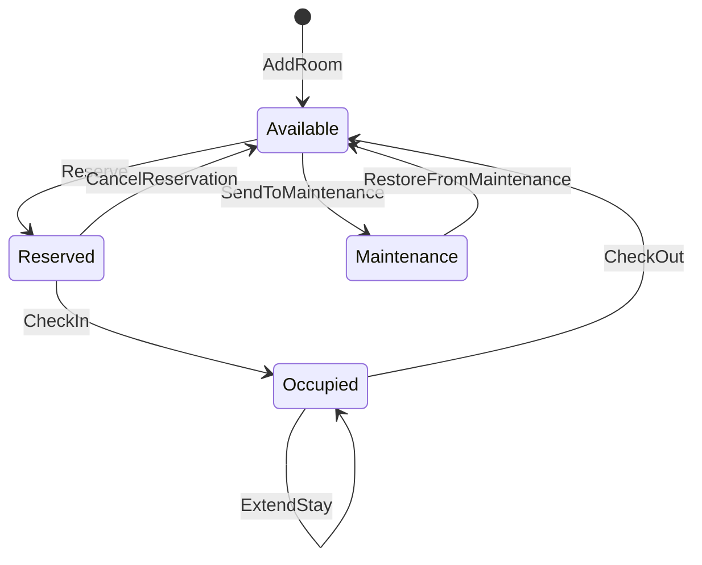

# HotelReservation — Proof of Work

## State Definition

| Field | Type |
|-------|------|
| total_rooms | int |
| available | int |
| reserved | int |
| occupied | int |
| maintenance | int |
| revenue | int |

**Initial state:** `VerifyState(total_rooms=0, available=0, reserved=0, occupied=0, maintenance=0, revenue=0)`

## Invariants

- **CountsConsistent**: `available + reserved + occupied + maintenance = total_rooms`
- **AllCountsNonNegative**: `available ≥ 0 ∧ reserved ≥ 0 ∧ occupied ≥ 0 ∧ maintenance ≥ 0`
- **RevenueNonNegative**: `revenue ≥ 0`

## State Transitions

### AddRoom

| | |
|---|---|
| **Guard** | `total_rooms < 6` |
| **Effect** | `total_rooms' = total_rooms + 1, available' = available + 1` |
| **Postcondition** | `( total_rooms' = total_rooms + 1 ∧ available' = available + 1 )` |

### Reserve

| | |
|---|---|
| **Guard** | `available > 0` |
| **Effect** | `available' = available - 1, reserved' = reserved + 1` |
| **Postcondition** | `( available' = available - 1 ∧ reserved' = reserved + 1 )` |

### CancelReservation

| | |
|---|---|
| **Guard** | `reserved > 0` |
| **Effect** | `reserved' = reserved - 1, available' = available + 1` |
| **Postcondition** | `( reserved' = reserved - 1 ∧ available' = available + 1 )` |

### CheckIn

| | |
|---|---|
| **Guard** | `reserved > 0` |
| **Effect** | `reserved' = reserved - 1, occupied' = occupied + 1` |
| **Postcondition** | `( reserved' = reserved - 1 ∧ occupied' = occupied + 1 )` |

### SendToMaintenance

| | |
|---|---|
| **Guard** | `available > 0` |
| **Effect** | `available' = available - 1, maintenance' = maintenance + 1` |
| **Postcondition** | `( available' = available - 1 ∧ maintenance' = maintenance + 1 )` |

### RestoreFromMaintenance

| | |
|---|---|
| **Guard** | `maintenance > 0` |
| **Effect** | `maintenance' = maintenance - 1, available' = available + 1` |
| **Postcondition** | `( maintenance' = maintenance - 1 ∧ available' = available + 1 )` |

### CheckOut *(parametric: charge)*

| | |
|---|---|
| **Guard** | `occupied > 0` |
| **Effect** | `occupied' = occupied - 1, available' = available + 1, revenue' = min(500, revenue + charge)` |
| **Postcondition** | `( occupied' = occupied - 1 ∧ available' = available + 1 ∧ revenue' = min(500, revenue + charge) )` |

## Temporal Properties

- **Eventually**(RoomsAvailable): `available > 0`
- **LeadsTo**(ReservationsResolve): `reserved > 0` ⟹ `reserved = 0`
- **AlwaysEventually**(RoomsBecomeFree): `available > 0`
